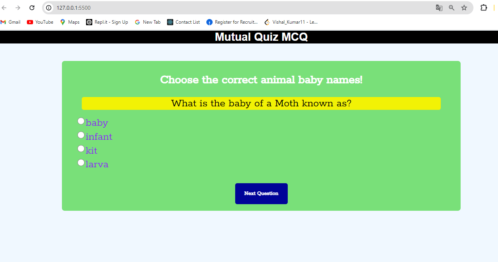

# Mutual Quiz

## Description

<p align="justify">✍Mutual Quiz is a simple multiple-choice quiz application that tests users' knowledge of animal baby names. The project was built to enhance understanding of basic HTML, CSS, and JavaScript/jQuery, and to provide a fun and interactive way to learn new information.</p>

## Table of Contents

- [Installation](#installation)
- [Usage](#usage)
- [Credits](#credits)
- [License](#license)

## Installation

1. Clone the repository:
    ```bash
    git clone https://github.com/yourusername/mutual-quiz.git
    ```
2. Navigate to the project directory:
    ```bash
    cd mutual-quiz
    ```
3. Open `index.html` in your web browser to start the quiz.

## Usage

- Open the `index.html` file in your preferred web browser.
- Answer the quiz questions by selecting the correct option for each animal baby name.
- Click "Next Question" to move to the next question.
- At the end of the quiz, your score will be displayed.

## Features
- Interactive multiple-choice questions.
- Instant feedback on selected answers.
- Score display at the end of the quiz.

## Credits

- Developed by [Your Name](https://github.com/yourusername).
- The quiz questions are inspired by various educational sources about animal baby names.

## License

This project is licensed under the MIT License - see the [LICENSE](LICENSE) file for details.

## Output Screenshoot

- Quiz Page
- 